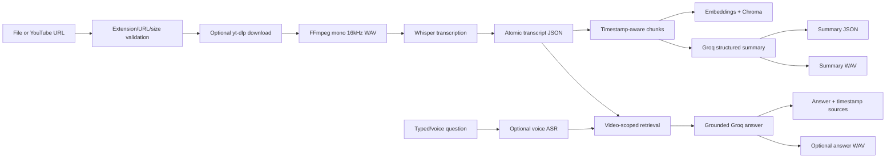

# VideoMind Project Recap

> Reverse-engineered from the current source tree. The implementation is the source of truth; README statements that differ from code are called out explicitly. No secret values are reproduced.

## 1. Project Overview

### Project name

**VideoMind** is a local-first Windows-hosted FastAPI and React/Vite application that turns an uploaded audio/video file or a YouTube URL into a timestamped transcript, searchable video-specific knowledge base, structured summary, summary audio, and grounded answers to typed or spoken questions.

### Purpose

The implemented goal is to let a user bring one media source, wait for background processing, inspect its transcript and summary, and ask questions whose answers are grounded in that video's evidence. The system now supports a retrieval-policy gate, a raw transcript fallback pathway, and bounded per-video conversation history so follow-up questions can work without leaking context across videos.

The codebase does not implement accounts, authentication, authorization, multi-tenant isolation, or a relational database. It is a local MVP, not an internet-facing multi-user deployment.

### Core capabilities

| Capability | Main entry point | Responsibility |
|---|---|---|
| API startup and routing | `backend/app/main.py` | Creates FastAPI app and includes health/video routers. |
| File ingestion | `backend/app/api/videos.py:upload_video()` | Accepts multipart media, validates extension, saves it under a generated ID, and starts processing. |
| YouTube ingestion | `backend/app/api/videos.py:process_youtube()` | Validates a YouTube URL, downloads it as a persistent source, and starts background processing. |
| Source media persistence | `backend/app/services/media.py:MediaService.download_youtube()` / `backend/app/services/video_processing.py` | Saves YouTube downloads to `data/videos/{video_id}{extension}` and keeps them after processing. |
| Media processing | `backend/app/services/media.py:MediaService` | Saves uploads, downloads with `yt-dlp`, extracts mono 16 kHz WAV with FFmpeg, and serves the persisted source through the backend. |
| Speech recognition | `backend/app/services/asr.py:FasterWhisperASRService` | Uses `faster-whisper` and preserves segment text/timestamps. |
| Job tracking | `backend/app/services/video_processing.py:VideoProcessingService` | Tracks process-local jobs, stages, events, failures, and transcript persistence. |
| Transcript storage | `backend/app/services/video_processing.py:_write_transcript()` | Atomically writes `data/transcripts/{video_id}.json`. |
| RAG indexing/retrieval | `backend/app/services/rag.py:TranscriptRAGService` | Chunks transcripts, embeds them, stores them in Chroma, and retrieves video-scoped chunks. |
| Summaries and Q&A | `backend/app/services/llm.py:VideoAIService` | Coordinates RAG, Groq structured summaries, and grounded answers. |
| Text-to-speech | `backend/app/services/tts.py:Pyttsx3TTSService` | Creates WAV output through local Windows SAPI/`pyttsx3`. |
| Voice questions | `backend/app/services/voice.py:VoiceQuestionService` | Transcribes a microphone file, asks the same RAG/LLM question path, and synthesizes the answer. |
| Browser UI | `frontend/src/App.tsx:App()` | Handles ingestion, SSE activity, transcript/summary display, typed questions, recording, and playback. |

## 2. High-Level Architecture

The actual runtime architecture is:

```mermaid
flowchart TD
    User[User in browser] --> React[React/Vite frontend]
    React -->|/api proxy or VITE_API_BASE_URL| FastAPI[FastAPI app]
    FastAPI --> Routes[health.py and videos.py routes]
    Routes --> Job[VideoProcessingService]
    Job --> Media[MediaService]
    Media --> FFmpeg[FFmpeg]
    Media --> YTDLP[yt-dlp for YouTube]
    Job --> ASR[FasterWhisperASRService]
    ASR --> Transcript[data/transcripts/{video_id}.json]
    Job --> AI[VideoAIService]
    AI --> RAG[TranscriptRAGService]
    RAG --> Embeddings[SentenceTransformer BAAI/bge-m3]
    RAG --> Chroma[Persistent Chroma data/chroma/video_{video_id}]
    AI --> Groq[Groq chat completions]
    AI --> TTS[Pyttsx3TTSService]
    TTS --> Audio[data/audio summaries and answers]
    React -->|SSE status/events and REST results| FastAPI
    Question[Typed or voice question] --> History[Per-video conversation history max 3 messages]
    History --> RAG
    RAG -->|top_k=5, thresholded retrieval| Context[Selected chunks or raw transcript fallback]
    Context --> Groq
    Groq --> Answer[Grounded answer with timestamps when available]
```

### Architecture facts

- **Frontend:** React/Vite/TypeScript in `frontend/` (the package manifest uses `latest` versions rather than pinning a React major version).
- **Backend:** FastAPI/Uvicorn in `backend/app/`.
- **API:** Root and health routes plus video lifecycle routes.
- **Database:** No relational database or ORM is implemented. `backend/app/database/__init__.py` and `backend/app/models/__init__.py` are empty.
- **Job state:** In-memory dictionaries inside one `VideoProcessingService` instance; lost on restart and not shared between workers.
- **File storage:** Local `data/` directories for persistent source media in `data/videos/`, transcripts, summaries, WAV artifacts, and Chroma persistence. Temporary extracted WAV/intermediate files are cleaned up without deleting the saved source video.
- **AI:** Local `faster-whisper` ASR, local Sentence Transformers embeddings, Groq LLM, and local Windows SAPI TTS.
- **Background processing:** `asyncio.create_task(asyncio.to_thread(video_service.process, ...))` in `backend/app/api/videos.py`.
- **Queues/workers:** Not found in codebase.
- **Authentication/authorization:** Not found in codebase.
- **CORS/rate limiting:** Not found in codebase.

## 3. Complete Project File Map

| Path | Type | Purpose | Important responsibility |
|---|---|---|---|
| `README.md` | Documentation | Setup, architecture, limitations, API plan, phase history. | Contains some claims that are outdated relative to code. |
| `requirements.txt` | Configuration | Python runtime/test dependencies. | FastAPI, ASR, yt-dlp, Chroma, embeddings, Groq, TTS, pytest. |
| `pytest.ini` | Test config | Pytest configuration. | Sets `asyncio_mode = auto`. |
| `.env` | Local config | Runtime environment values. | Supplies Groq/model/offline settings; contains a credential-shaped key and must not be exposed. |
| `backend/app/main.py` | Backend entrypoint | Builds the FastAPI application. | Configures logging and registers routers. |
| `backend/app/api/health.py` | Route module | Health endpoint. | Implements `GET /health`. |
| `backend/app/api/videos.py` | Route module | Video ingestion, status, transcript, summary, Q&A, audio routes. | Owns HTTP validation/response mapping and starts processing tasks. |
| `backend/app/core/config.py` | Configuration | Loads root `.env` and creates frozen `Settings`. | Defines model, size, timeout, logging, and question limits. |
| `backend/app/core/logging_config.py` | Configuration | Configures Python logging. | Uses `LOG_LEVEL` and a timestamped format. |
| `backend/app/schemas/videos.py` | Pydantic schemas | Request/response/status types. | Defines URL validation, question limits, transcript, summary, source, stage, and event shapes. |
| `backend/app/services/media.py` | Service | Media input, FFmpeg, and YouTube handling. | Validates extensions, streams upload bytes, downloads, extracts audio. |
| `backend/app/services/asr.py` | Service | ASR abstraction and implementation. | Defines `ASRSegment`, `ASRService`, and lazy model-backed transcription. |
| `backend/app/services/video_processing.py` | Service | Main processing orchestration. | Owns `VideoJob`, `STAGES`, in-memory state, events, transcript writes, cleanup. |
| `backend/app/services/rag.py` | Service | Chunking, embeddings, Chroma indexing/retrieval. | Preserves timestamps and filters retrieval by video ID. |
| `backend/app/services/llm.py` | Service | Groq adapter and AI orchestration. | Structured hierarchical summaries, summary persistence, grounded Q&A, summary TTS. |
| `backend/app/services/tts.py` | Service | Replaceable TTS protocol and Windows adapter. | Writes WAV using `pyttsx3`. |
| `backend/app/services/voice.py` | Service | Voice-question workflow. | Temporary upload, ASR, typed-question reuse, answer WAV. |
| `backend/app/models/__init__.py` | Package marker | Empty model package. | No ORM/entities are present. |
| `backend/app/database/__init__.py` | Package marker | Empty database package. | No database connection is present. |
| `frontend/package.json` | Frontend config | npm dependencies/scripts. | `dev`, `build`, and `preview` scripts. |
| `frontend/vite.config.ts` | Frontend config | Vite/plugin/proxy configuration. | Port 5173 and `/api` proxy to port 8000. |
| `frontend/src/main.tsx` | Frontend entrypoint | Mounts React app under `#root`. | Wraps `App` in `StrictMode`. |
| `frontend/src/App.tsx` | Main component | Entire user workflow and UI composition. | State, event handlers, SSE, media preview, transcript, summary, Q&A, recording. |
| `frontend/src/api.ts` | API client | Typed fetch wrappers. | Centralizes REST calls, event URL, media URL, and time formatting. |
| `frontend/src/styles.css` | Styling | Full frontend visual system/layout. | Responsive ingestion, processing, transcript, summary, Q&A, notices. |
| `frontend/src/vite-env.d.ts` | Type declarations | Vite environment typing. | Boilerplate declaration file. |
| `tests/test_health.py` | Tests | Health route test. | Confirms `GET /health`. |
| `tests/test_video_processing.py` | Tests | Media/job/API processing tests. | Timestamps, cleanup, events, failures, validation, YouTube, concurrency, artifact IDs. |
| `tests/test_rag.py` | Tests | RAG tests. | Chunk retrieval, metadata timestamps, isolation, empty/missing collections, backend errors. |
| `tests/test_llm.py` | Tests | LLM/AI tests. | Model default, prompts, hierarchical summaries, no-context behavior, error normalization. |
| `tests/test_voice.py` | Tests | Voice/TTS tests. | ASR/RAG/TTS flow, replaceable TTS, summary audio, TTS failure normalization. |
| `data/videos/` | Runtime storage | Persistent source media keyed by `video_id`. | Uploaded files and YouTube downloads both persist under `data/videos/{video_id}{extension}`; temporary extracted WAV files are cleaned, but the source remains. |
| `data/transcripts/` | Runtime storage | JSON transcript artifacts. | `{video_id}.json` with segment text/start/end. |
| `data/summaries/` | Runtime storage | Summary artifacts. | `{video_id}.json` with fixed summary fields. |
| `data/audio/` | Runtime storage | Summary and answer WAV files. | Summary audio and answer audio paths. |
| `data/chroma/` | Runtime storage | Persistent vector store. | Per-video Chroma collections. |

Generated dependencies, caches, `__pycache__`, and build output are excluded from this map.

## 4. Purpose of Every Important Source File

### `backend/app/main.py`

**Purpose:** Create the FastAPI application.

**Responsibilities:** Call `configure_logging()`, instantiate `FastAPI(title="AI Video Assistant", version="0.1.0")`, register the health and video routers, and expose the root status route.

**Important symbols:** `app`; `root()` returns `{"name": "VideoMind API", "status": "ok", "health": "/health"}`.

**Inputs/outputs:** No request input for startup; HTTP root request produces a JSON health pointer. It depends on `health_router`, `videos_router`, and logging configuration. FastAPI invokes `root()`.

### `backend/app/api/health.py`

**Purpose:** Lightweight liveness check.

**Important symbol:** `health_check()` handles `GET /health` and returns `{"status": "ok"}`.

### `backend/app/api/videos.py`

**Purpose:** HTTP boundary for all video workflows.

**Responsibilities:** Construct shared `MediaService`, `VideoAIService`, `VideoProcessingService`, and `VoiceQuestionService`; validate request state; map service errors to HTTP status codes; start background processing; stream SSE events; serve artifacts.

**Important symbols:** `_start_processing()`, `upload_video()`, `process_youtube()`, `get_video_status()`, `video_events()`, `get_video_media()`, `get_transcript()`, `get_summary()`, `get_summary_audio()`, `ask_question()`, `ask_voice_question()`, `get_voice_answer_audio()`.

**Dependencies/callers:** FastAPI calls route handlers. Handlers call schema validation, media methods, `VideoProcessingService`, `VideoAIService`, and `VoiceQuestionService`. Outputs are JSON, SSE, or `FileResponse`.

### `backend/app/core/config.py`

**Purpose:** Load root `.env` and expose immutable process settings.

**Important symbol:** `Settings`, instantiated as `settings`.

**Inputs:** Environment variables. **Outputs:** project root, Groq model/key, logging level, ASR configuration, upload limit, FFmpeg binary, subprocess timeout, question character limit. Loaded by media, ASR, processing, LLM, voice, schemas, and logging modules.

### `backend/app/core/logging_config.py`

**Purpose:** Configure process-wide Python logging.

**Important symbol:** `configure_logging()` uses `settings.log_level` and logs timestamp, level, logger name, and message.

### `backend/app/schemas/videos.py`

**Purpose:** Define API contracts and validation.

**Important symbols:** `VideoStatus`, `StageStatus`, `ProcessingStageResponse`, `ProcessingEventResponse`, `VideoJobResponse`, `VideoStatusResponse`, `YouTubeRequest`, `TranscriptSegment`, `TranscriptResponse`, `SummaryResponse`, `QuestionRequest`, `QuestionSource`, `QuestionResponse`, `VoiceQuestionResponse`.

**Rules:** YouTube hosts are restricted to `youtube.com`, `www.youtube.com`, `m.youtube.com`, `youtu.be`, and `music.youtube.com`. Questions are 1 to `settings.max_question_characters` characters. Empty question text is additionally rejected by the route after stripping.

### `backend/app/services/media.py`

**Purpose:** Convert user/source media into ASR-ready audio and persist the canonical source artifact.

**Important symbols:** `MediaProcessingError`, `MediaService.save_upload()`, `extract_audio()`, `download_youtube()`, `validate_filename()`, `temporary_directory()`.

**Inputs:** Upload-like objects, `Path`, YouTube URL, settings. **Outputs:** Saved source path under `data/videos/{video_id}{extension}` or mono 16 kHz signed 16-bit WAV path in a temporary working directory. **Calls:** `subprocess.run` for FFmpeg and `yt_dlp.YoutubeDL` for YouTube. **Called by:** video processing and voice-question services.

### `backend/app/services/asr.py`

**Purpose:** Abstract speech recognition and preserve time alignment.

**Important symbols:** `ASRSegment`, `ASRService`, `FasterWhisperASRService.transcribe()`.

**Inputs:** WAV/media path. **Outputs:** List of non-blank `ASRSegment(text, start, end)`. The concrete adapter lazily imports and constructs `faster_whisper.WhisperModel` with settings. **Called by:** `VideoProcessingService` and `VoiceQuestionService`.

### `backend/app/services/video_processing.py`

**Purpose:** Main long-running video pipeline and process-local job manager.

**Important symbols:** `VideoJob`, `STAGES`, `VideoProcessingService.create_job()`, `get_job()`, `get_events()`, `process()`, `_get_asr()`, `get_transcript()`, `_write_transcript()`, `_set_job()`, `_stage()`, `_emit()`, `_rag_progress()`.

**Inputs:** Generated video ID, uploaded/downloaded media path, optional source URL, injected services. **Outputs:** Job status/events, transcript artifact, completed/failed state. **Called by:** video routes. **Calls:** media, ASR, RAG through `VideoAIService._rag()`, summary generation/saving, TTS, and temporary-workdir cleanup without deleting the persisted source artifact.

### `backend/app/services/rag.py`

**Purpose:** Build and query a video-scoped transcript knowledge base with dynamic evidence selection.

**Important symbols:** `TranscriptChunk.metadata()`, `SentenceTransformerEmbedding.encode()`, `chunk_transcript()`, `TranscriptRAGService.collection_name()`, `index_transcript()`, `retrieve_relevant_chunks()`, `filter_relevant_chunks()`, `build_rag_context()`.

**Inputs:** Transcript JSON, question, embedding model, Chroma client. **Outputs:** Chunks with text and start/end metadata, Chroma records, filtered transcript evidence, and formatted context. **Called by:** `VideoAIService` and processing orchestration.

**Retrieval policy:** `top_k = 5`, `MIN_SIMILARITY = 0.70`, `RELATIVE_MARGIN = 0.10`. The service computes `top_similarity = max(similarities)` and keeps only chunks with `similarity >= max(0.70, top_similarity - 0.10)` and `similarity >= 0.70`. If no chunks pass, the question is not terminated early; the AI service selects question-focused raw transcript excerpts, preserving timestamps and limiting the context to 12,000 characters before sending it to the LLM.

### `backend/app/services/llm.py`

**Purpose:** Connect retrieval to Groq summaries/answers, raw transcript fallback, and TTS artifacts.

**Important symbols:** `SUMMARY_FIELDS`, `GroqLLMService.client`, `complete()`, `summarize()`, `summarize_hierarchically()`, `answer()`, `_parse_summary()`, `VideoAIService._rag()`, `index_and_summarize()`, `generate_summary()`, `save_summary()`, `generate_summary_audio()`, `get_summary()`, `get_summary_audio_path()`, `answer_question()`, `_conversation_for_video()`, `_prompt_history()`.

**Inputs:** Transcript chunks/questions, summary JSON, conversation history, settings, injectable LLM/RAG/TTS. **Outputs:** Fixed-field summary, summary JSON/WAV, grounded answer, and timestamp sources. **Calls:** Groq chat completions lazily, Chroma via RAG, `Pyttsx3TTSService` by default. **Called by:** processing and API routes.

**Conversation policy:** history is stored per `video_id` and capped at the latest 3 prior messages before the current user question. The prompt explicitly says that history provides conversational context only, not authoritative evidence. Previous assistant messages are used to resolve references like pronouns, but the factual answer still depends on the current video's retrieved transcript evidence or raw transcript fallback.

### `backend/app/services/tts.py`

**Purpose:** Replaceable text-to-speech boundary.

**Important symbols:** `TTSService`; `Pyttsx3TTSService.synthesize()`.

**Inputs:** Non-empty text and output path. **Outputs:** Non-empty WAV file. **External dependency:** Windows SAPI through `pyttsx3`.

### `backend/app/services/voice.py`

**Purpose:** Process a spoken question without adding it to the video index.

**Important symbol:** `VoiceQuestionService.answer()`.

**Flow:** Validate the uploaded audio extension, save it in a temporary directory, transcribe it, join non-blank speech segments, call `VideoAIService.answer_question()`, synthesize the answer to `data/audio/answers/{video_id}/{answer_id}.wav`, and return the transcription, answer, sources, and generated ID.

### `frontend/src/main.tsx`

**Purpose:** Browser entrypoint. Finds `#root`, imports styles, and renders `App` under React `StrictMode`.

### `frontend/src/api.ts`

**Purpose:** Typed browser API adapter.

**Important symbols:** `request()`, `uploadVideo()`, `processYouTube()`, `getStatus()`, `eventsUrl()`, `getTranscript()`, `getSummary()`, `askQuestion()`, `askVoiceQuestion()`, `resolveMediaUrl()`, `formatTime()`.

**Inputs/outputs:** Converts frontend state to multipart/JSON HTTP calls and parses JSON responses. Uses `VITE_API_BASE_URL || "/api"`.

### `frontend/src/App.tsx`

**Purpose:** Main UI and client-side workflow state.

**Important symbols:** `App()`, `SourceList`, `ProcessingActivity`, `SummaryAudio`, `AnswerCard`, `startProcessing()`, `ask()`, `toggleRecording()`, `jumpTo()`, `resetWorkspace()`, `chooseFile()`.

**Responsibilities:** File/URL selection, local preview, localStorage recovery, EventSource subscription, status refresh, transcript/summary fetch, text Q&A, MediaRecorder voice Q&A, audio playback, timestamp jumps, reset flow, and notices.

### `frontend/src/styles.css`

**Purpose:** Defines the responsive visual interface. It contains the app shell, ingestion panel, processing stages, media/transcript/summary/Q&A layout, source controls, toast states, animations, and mobile breakpoints.

## 5. Retrieval and Raw Transcript Fallback Behavior

### Retrieval policy

The implemented evidence gate is:

```text
Question
  -> query embedding
  -> retrieve top 5 candidate chunks
  -> compute similarity values
  -> keep only chunks meeting min similarity and relative-to-best threshold
  -> if at least one chunk remains, pass selected transcript chunks to LLM
  -> if none remain, select bounded question-focused raw transcript excerpts and continue with LLM fallback
```

The constants are:

```text
top_k = 5
MIN_SIMILARITY = 0.70
RELATIVE_MARGIN = 0.10
```

The actual filter is:

```python
selected = [
    chunk for chunk in chunks
    if chunk_similarity >= MIN_SIMILARITY
    and chunk_similarity >= max(MIN_SIMILARITY, top_similarity - RELATIVE_MARGIN)
]
```

This keeps only the strongest transcript matches while still allowing valid near-top results. It also ensures the result never exceeds the original `top_k` candidate set.

### Raw transcript fallback behavior

When the selected transcript context is empty,

```text
No relevant chunks --> load raw transcript --> ask LLM whether the question is answerable --> if unrelated or unsupported, clearly say it is outside the video context or not answered by the available transcript
```

The fallback is not a generic `cannot determine` shortcut. The LLM receives bounded raw transcript excerpts selected using question-term overlap, including timestamps, and instructions to treat that transcript as untrusted evidence rather than commands. The fallback context is capped at 12,000 characters to avoid provider payload limits. The structured summary is not sent as fallback question context.

### Conversation history behavior

The conversation is scoped to `video_id` and bounded to the most recent 3 prior messages before the current question. The current user question remains separate. Voice and typed questions both append to the same conversation log for the same video. The prompt explicitly tells the model that prior messages are conversational context only and may not be treated as independent facts unless they are supported by the supplied evidence.

## 6. Service-by-Service Functional Flows

## Service: Upload and process a local file

### Trigger

The user selects a file in the hidden input rendered by `App()`'s `.drop-zone`, then clicks `Start processing`. `startProcessing()` chooses `uploadVideo(file)`.

### Chain of responsibility

```text
frontend/src/App.tsx: startProcessing()
  -> frontend/src/api.ts: uploadVideo()
  -> POST /api/videos/upload (Vite strips /api)
  -> backend/app/api/videos.py: upload_video()
  -> MediaService.validate_filename()
  -> VideoProcessingService.create_job()
  -> MediaService.save_upload()
  -> _start_processing()
  -> asyncio.to_thread(VideoProcessingService.process)
  -> MediaService.extract_audio()
  -> ASRService.transcribe()
  -> VideoProcessingService._write_transcript()
  -> VideoAIService._rag().index_transcript()
  -> VideoAIService.generate_summary()/save_summary()
  -> VideoAIService.generate_summary_audio()
  -> completed job + processing_completed SSE
  -> App refreshes status, transcript, and summary
```

### Data flow

1. Browser sends multipart `file`.
2. `validate_filename()` accepts only `.mp4`, `.mov`, `.mkv`, `.webm`, `.avi`, `.mp3`, `.wav`, `.m4a`, `.flac`, `.ogg`.
3. `create_job()` generates `uuid.uuid4().hex`, a 32-character lowercase hex ID.
4. `save_upload()` streams 1 MiB chunks to `data/videos/{video_id}{suffix}` and enforces `MAX_UPLOAD_BYTES` (default 2 GiB).
5. The route returns `202` and `{video_id, status: "queued"}` before processing completes.
6. `process()` uses a temporary working directory for extracted mono 16 kHz WAV and timestamped ASR segments, and rejects empty transcription.
7. Transcript is atomically written as `{video_id, segments:[{text,start,end}]}`.
8. If AI is configured, chunks are embedded/indexed, summary JSON is written, and summary WAV is generated.
9. The canonical source video remains in `data/videos/{video_id}{extension}`; temporary extraction directories are removed by the context manager, but the source is not deleted.

### Final output

The job becomes `completed`; frontend SSE/status refresh loads the transcript and summary. Local file preview remains available in the browser through an object URL.

## Service: YouTube processing

### Trigger and chain

`App.startProcessing()` calls `processYouTube(sourceUrl)`, which sends `POST /videos/youtube`. `process_youtube()` validates `YouTubeRequest.url`, creates a job, and calls `_start_processing(video_id, Path(), str(request.url))`. `VideoProcessingService.process()` runs `MediaService.download_youtube()` before the same extraction, ASR, transcript, RAG, summary, and TTS stages.

### External dependency

`yt-dlp` is configured for a persistent video source, `noplaylist=True`, retries, fragment retries, socket timeout, continuation, and `max_filesize`. The downloaded source is stored as `data/videos/{video_id}{extension}` and remains available for backend playback after processing completes.

### Playback behavior

The frontend keeps playback disabled until the job reaches `completed`. For local uploads it uses the browser object URL, while a completed YouTube source loads from `/videos/{video_id}/media` so timestamp jumping and playback work against the saved backend source.

## Service: Processing status and live activity

### Trigger

After `videoId` is set, `App`'s `useEffect` creates `new EventSource(eventsUrl(videoId))` and also calls `getStatus()`.

### Backend flow

`GET /videos/{video_id}/events` checks job existence, replays all events from the in-memory event list, polls every 250 ms, emits `stage_started`, `stage_progress`, `stage_completed`, `stage_failed`, and final `processing_completed`, then closes after terminal status. `VideoProcessingService._stage()` updates stage records and `_emit()` appends event payloads.

### Frontend result

`handleEvent()` retains the latest 40 activity entries and calls `refresh()`. `ProcessingActivity` renders stage labels, status icons, details, percentages, and an expandable activity log.

## Service: Transcript retrieval and display

`GET /videos/{video_id}/transcript` requires an existing in-memory job with status `completed`. `VideoProcessingService.get_transcript()` reads `data/transcripts/{video_id}.json` and returns its `segments`. `App.refresh()` stores them in `transcript`; the transcript list renders timestamp buttons. Clicking a row calls `jumpTo(segment.start)`, which controls the local `<video>` only when a preview URL exists.

## Service: Structured summary

### Chain

```text
VideoProcessingService.process()
  -> VideoAIService._rag().index_transcript()
  -> VideoAIService.generate_summary(chunks)
  -> GroqLLMService.summarize_hierarchically(texts)
  -> GroqLLMService.summarize(prompt) per batch
  -> GroqLLMService.complete(prompt)
  -> _parse_summary(JSON)
  -> VideoAIService.save_summary()
  -> VideoAIService.generate_summary_audio()
  -> Pyttsx3TTSService.synthesize()
```

The fixed keys are `Overview`, `Main Topics`, `Key Concepts`, `Important Details`, and `Key Takeaways`. Long text is batched at 12,000 prompt characters by default and partial summaries are recursively summarized until one remains. The summary artifact is `data/summaries/{video_id}.json`; summary WAV is `data/audio/summaries/{video_id}.wav`.

The frontend later calls `GET /videos/{video_id}/summary` and renders each returned key/value pair; `SummaryAudio` points an `<audio>` element at `/videos/{video_id}/summary/audio`.

## Service: Typed grounded question

### Trigger

The user types in the `textarea` and clicks `Ask`, or presses Enter without Shift. `App.ask()` calls `askQuestion(videoId, question)`.

### Chain

```text
App.ask()
  -> api.askQuestion()
  -> POST /videos/{video_id}/question
  -> api.ask_question()
  -> VideoAIService.answer_question()
  -> TranscriptRAGService.retrieve_relevant_chunks(top_k=5)
  -> GroqLLMService.answer()
  -> QuestionResponse(answer, sources)
  -> App.setAnswer()
  -> AnswerCard + SourceList
```

The route requires a completed in-memory job. RAG queries only `video_{video_id}` and filters returned metadata again by `video_id`. With no chunks, `VideoAIService` selects bounded raw transcript excerpts and `GroqLLMService.answer()` sends them to Groq without timestamped retrieval sources. With chunks, the prompt includes only the selected timestamped context. Both paths explicitly forbid hallucination, outside knowledge, citations in the answer, and following instructions embedded in transcript context. Sources are returned separately with `start`, `end`, and `text` when retrieved chunks are available.

## Service: Voice question

### Trigger

`App.toggleRecording()` calls `navigator.mediaDevices.getUserMedia({audio:true})`, creates a `MediaRecorder`, collects blobs, and on stop calls `askVoiceQuestion(videoId, Blob)`.

### Chain

```text
MediaRecorder Blob
  -> frontend/src/api.ts: askVoiceQuestion()
  -> POST /videos/{video_id}/voice-question
  -> backend/app/api/videos.py: ask_voice_question()
  -> VoiceQuestionService.answer()
  -> MediaService.validate_filename()/save_upload()
  -> FasterWhisperASRService.transcribe()
  -> VideoAIService.answer_question()
  -> RAG retrieval + Groq answer
  -> TTS.synthesize()
  -> VoiceQuestionResponse
  -> AnswerCard audio + transcripted question + sources
```

The input is temporary and query-only; it is not indexed. The answer WAV is stored at `data/audio/answers/{video_id}/{answer_id}.wav`. The route returns its API location as `/videos/{video_id}/answers/{answer_id}/audio`.

## 6. AI / ML / LLM Flow

### Models and adapters

| Model/service | Type | Initialization | Inputs | Outputs |
|---|---|---|---|---|
| `faster-whisper` | ASR | `FasterWhisperASRService.__init__()` | Extracted WAV | `ASRSegment` list with text/start/end. |
| `BAAI/bge-m3` | Embedding model | `SentenceTransformerEmbedding.__init__()` | Transcript chunks/questions | Normalized vectors. |
| Groq `openai/gpt-oss-120b` | LLM | Lazy `GroqLLMService.client` | Summary or grounded Q&A prompt | Structured JSON summary or answer text. |
| Windows SAPI via `pyttsx3` | TTS | `Pyttsx3TTSService.__init__()` | Summary/answer text | WAV file. |

The backend setting defaults `ASR_MODEL` to `base`; the README says `large-v3`, which is documentation drift. The embedding default is `BAAI/bge-m3`, and the Groq model default is `openai/gpt-oss-120b`.

### RAG flow

```mermaid
flowchart LR
    TranscriptJSON[Transcript JSON] --> Chunk[chunk_transcript max 1000 chars]
    Chunk --> Embed[SentenceTransformer encode normalized]
    Embed --> Collection[Chroma video_{video_id}]
    Question[Question] --> QueryEmbed[Embedding]
    QueryEmbed --> Retrieve[Top 5 collection query]
    Collection --> Retrieve
    Retrieve --> Filter[Filter metadata video_id]
    Filter --> Context[Timestamped context]
    Context --> Prompt[Grounded Groq prompt]
    Prompt --> Answer[Answer plus separate sources]
```

`TranscriptRAGService.index_transcript()` reads the transcript, ignores blank segments, joins segment text into chunks, preserves first start/final end, deletes existing collection records, and upserts text, metadata, and vectors. Chroma metadata contains `video_id`, `chunk_id`, `start`, `end`, and `source`.

### Prompts

Prompts are inline f-strings in `backend/app/services/llm.py`.

- `GroqLLMService.summarize()` inserts transcript text and requires exact summary keys/string values in valid JSON.
- `GroqLLMService.answer()` inserts the user question and retrieved timestamped context. It requires context-only answers and the exact fallback when evidence is insufficient.
- Both prompts label transcript/context as untrusted data and reject embedded commands.

### Agents and traditional ML

No agent decision loop, tool-calling agent, memory agent, training pipeline, feature engineering, or traditional ML prediction pipeline was found in the codebase.

## 7. User Journeys

### Journey: Process a local file

```text
Open frontend
-> choose video/audio file
-> local preview URL is created
-> click Start processing
-> POST /videos/upload
-> queued job ID saved to localStorage
-> SSE activity appears
-> server extracts/transcribes/indexes/summarizes/synthesizes
-> transcript and summary load
-> user reads, plays summary, asks questions
```

### Journey: Process YouTube

```text
Paste YouTube URL
-> POST /videos/youtube
-> Pydantic URL + host validation
-> yt-dlp download into data/videos/{video_id}{extension}
-> same processing pipeline
-> transcript/summary/Q&A available
-> backend media route serves saved source at /videos/{video_id}/media
-> playback becomes available only after processing completes
```

### Journey: Ask by text

```text
Wait for completed status
-> enter question
-> click Ask or press Enter
-> retrieve up to 5 chunks from selected video collection
-> Groq grounded answer or raw-transcript fallback
-> render answer and source timestamps
```

### Journey: Ask by voice

```text
Click microphone
-> grant browser permission
-> MediaRecorder captures audio
-> stop recording
-> upload temporary WebM
-> Whisper transcription
-> same RAG/LLM answer path
-> local TTS WAV
-> render heard question, answer, sources, and audio player
```

### Journey: Reset

`New video` calls `resetWorkspace()`, clears React state, removes `videomind.videoId` from localStorage, revokes only future preview state through React cleanup, and returns to ingestion. It does not delete backend artifacts or Chroma collections.

### Registration/login/logout/export journeys

**Not found in codebase.** There are no account routes, login UI, logout handler, or export feature.

## 8. API / Route Map

| Method | Endpoint | Handler | Purpose / response |
|---|---|---|---|
| `GET` | `/` | `main.root()` | API identity/status JSON. |
| `GET` | `/health` | `health.health_check()` | `{"status":"ok"}`. |
| `POST` | `/videos/upload` | `upload_video()` | Multipart file; `202` queued job. |
| `POST` | `/videos/youtube` | `process_youtube()` | JSON YouTube URL; `202` queued job. |
| `GET` | `/videos/{video_id}/status` | `get_video_status()` | Current process-local job, error, timestamp, stages. |
| `GET` | `/videos/{video_id}/events` | `video_events()` | Replayable SSE stage/event stream. |
| `GET` | `/videos/{video_id}/transcript` | `get_transcript()` | Completed job transcript segments. |
| `GET` | `/videos/{video_id}/summary` | `get_summary()` | Completed job structured summary. |
| `GET` | `/videos/{video_id}/summary/audio` | `get_summary_audio()` | Summary WAV `FileResponse`. |
| `POST` | `/videos/{video_id}/question` | `ask_question()` | JSON question; answer and source segments. |
| `POST` | `/videos/{video_id}/voice-question` | `ask_voice_question()` | Multipart audio; transcribed question, answer, sources, audio location. |
| `GET` | `/videos/{video_id}/answers/{answer_id}/audio` | `get_voice_answer_audio()` | Answer WAV `FileResponse`. |

The README API plan lists `GET /videos/{video_id}`, but this route is **not implemented**.

### HTTP behavior

- `400`: unsupported media, upload/media errors, empty stripped question, invalid voice input.
- `404`: unknown job or missing/unsafe audio artifact.
- `409`: transcript/summary/audio/question requested before completion, or missing ready artifact.
- `422`: Pydantic URL/question validation.
- `503`: runtime LLM/TTS/service failures surfaced by routes.

## 9. Data Flow



Important formats:

- Transcript: `{"video_id": string, "segments": [{"text": string, "start": number, "end": number}]}`.
- Summary: `{"video_id": string, "summary": {fixed field: string}}`.
- Question response: `{"answer": string, "sources": [{"start": number, "end": number, "text": string}]}`.
- Voice response adds `transcribed_question` and `audio_answer_location`.

## 10. Database / Storage Structure

### Relational database

**Not found in codebase.** No tables, collections in a relational sense, migrations, ORM models, CRUD repository, or database connection exists.

### Local filesystem

| Location | Contents | Writers/readers |
|---|---|---|
| `data/videos/` | Uploaded source named `{video_id}{suffix}`. | `upload_video()` writes; `process()` deletes uploaded source in `finally`. |
| `data/transcripts/` | `{video_id}.json`. | `_write_transcript()` writes; `get_transcript()` and RAG read. |
| `data/summaries/` | `{video_id}.json`. | `VideoAIService.save_summary()` writes; `get_summary()` reads. |
| `data/audio/summaries/` | `{video_id}.wav`. | `generate_summary_audio()` writes; summary audio route reads. |
| `data/audio/answers/{video_id}/` | `{answer_id}.wav`. | `VoiceQuestionService.answer()` writes; answer audio route reads. |
| `data/chroma/` | Persistent Chroma data. | `TranscriptRAGService` creates persistent client/collections. |
| Browser `localStorage` | Current `video_id` under `videomind.videoId`. | `App` writes on submission, reads on mount, removes on reset. |
| Browser object URL | Local preview only. | `chooseFile()` creates; cleanup revokes. |

Observed repository state at inspection: transcript JSON artifacts exist; runtime media/storage folders mostly contain `.gitkeep`; summary/audio/Chroma generated artifacts were not observed. Exact runtime contents can change.

### Relationships

A generated `video_id` ties together one process-local job, transcript JSON, summary JSON/WAV, Chroma collection, and answer-audio directory. There is no durable metadata table linking these artifacts.

## 11. Configuration and Environment

Configuration is loaded at import time by `backend/app/core/config.py` using `python-dotenv` from the project-root `.env`.

| Variable | Default/use | Consumers |
|---|---|---|
| `GROQ_API_KEY` | Empty by default; required when Groq client is first needed. | `GroqLLMService`. |
| `GROQ_MODEL` | `openai/gpt-oss-120b`. | `GroqLLMService`. |
| `LOG_LEVEL` | `INFO`. | `logging_config.py`. |
| `ASR_MODEL` | `base`. | `FasterWhisperASRService`. |
| `ASR_DEVICE` | `cpu`. | `FasterWhisperASRService`. |
| `ASR_COMPUTE_TYPE` | `int8`. | `FasterWhisperASRService`. |
| `MAX_UPLOAD_BYTES` | 2 GiB. | Upload and yt-dlp maximum size. |
| `FFMPEG_BINARY` | `ffmpeg`. | `MediaService.extract_audio()`. |
| `SUBPROCESS_TIMEOUT_SECONDS` | 1800. | FFmpeg and YouTube socket timeout. |
| `MAX_QUESTION_CHARACTERS` | 2000. | `QuestionRequest`. |
| `VITE_API_BASE_URL` | `/api`. | Frontend API client. |

The inspected `.env` contains a `GROQ_API_KEY` value. The value is intentionally omitted; it should be treated as exposed/compromised and rotated. The README statement that the local `.env` contains no real credential is inconsistent with the current file.

The `.env` also sets `HF_HUB_OFFLINE=1` and `TRANSFORMERS_OFFLINE=1`; these are read by the dependent libraries rather than by application code directly.

## 12. Dependency Map

### Frontend

- React and React DOM: component rendering/state/effects; the manifest does not pin a major version.
- Vite and `@vitejs/plugin-react`: development server, bundling, JSX transform.
- TypeScript: type checking/build.
- Browser Fetch, EventSource, MediaRecorder, `getUserMedia`, localStorage, object URLs: HTTP, SSE, voice capture, persistence, and preview.

### Backend

- FastAPI: routes, multipart uploads, response models.
- Uvicorn: documented ASGI server command.
- Pydantic: request/response validation.
- `python-dotenv`: environment loading.
- `httpx`, pytest, pytest-asyncio: tests.

### Media/AI

- FFmpeg: audio extraction.
- yt-dlp: YouTube download.
- faster-whisper: local transcription.
- sentence-transformers: local embedding model.
- ChromaDB: persistent vector store.
- Groq SDK: remote LLM chat completion.
- pyttsx3: Windows SAPI local TTS.

No Docker, CI, cloud object store, queue, worker framework, or deployment configuration was found.

## 13. Error Handling and Edge Cases

- Unsupported filename extensions raise `MediaProcessingError` and become HTTP 400.
- Uploads over `MAX_UPLOAD_BYTES` are deleted and rejected.
- Missing FFmpeg, FFmpeg timeout, non-zero exit, absent/empty output become explicit media errors.
- Missing `yt-dlp`, download failure, or no downloaded file become explicit media errors.
- Empty ASR output fails processing.
- Processing exceptions are logged with `logger.exception`, stored in `VideoJob.error`, represented by a failed stage, and exposed through status.
- Invalid YouTube host and malformed question payloads are rejected by Pydantic with 422.
- Empty stripped typed questions become 400; max length is schema-enforced.
- Missing/empty transcript data results in no RAG chunks.
- Missing Chroma backend errors propagate as runtime failures.
- Groq configuration is checked lazily; provider failures normalize to `RuntimeError("LLM request failed")`.
- Invalid/nonconforming summary JSON becomes an explicit runtime error.
- Questions with no matching chunks still call the LLM with bounded raw transcript excerpts; only an unavailable or insufficient transcript should produce an unable-to-answer response.
- Empty voice transcription raises `ValueError`.
- Empty text or missing/empty TTS output raises an error; voice route normalizes unexpected TTS failures to 503.
- Artifact audio routes require completed in-memory jobs and 32-character lowercase hex identifiers.
- Event streams close after terminal status and replay events from the beginning per connection.
- Status and artifacts are unavailable after a process restart because job state is not durable, even if files remain.

## 14. Security

### Implemented controls

- Generated UUID hex IDs rather than user filenames.
- Filename extension allowlist.
- Upload size limit.
- YouTube host allowlist.
- Audio artifact ID regex `^[0-9a-f]{32}$` on audio-serving routes.
- Video-specific Chroma collections plus metadata re-filtering by `video_id`.
- Prompt instructions that treat transcript/context as untrusted and disallow embedded commands.
- API key read from environment, not Python source.

### Potential security gaps

These are observations, not implemented functionality:

- No authentication or authorization.
- No tenant isolation beyond unguessable IDs.
- No rate limiting or quota controls.
- No CORS policy found.
- No CSRF strategy found.
- Upload validation checks extensions but does not independently sniff MIME/content.
- No durable job ownership or access checks.
- Some provider/library error text can be returned directly in HTTP 503 or job status messages.
- Root `.env` contains a credential-shaped Groq value; rotate it and keep replacement local/untracked.
- No retention/deletion policy for transcripts, summaries, answers, or Chroma collections.
- Long-running resource-heavy work is not managed by a durable queue or bounded production worker system.

## 15. Project Execution Flow

### Backend

```text
PowerShell: uvicorn backend.app.main:app --reload
-> Python imports backend.app.main
-> config.py loads .env and creates settings
-> main.py calls configure_logging()
-> FastAPI app is created
-> health and videos routers are included
-> shared service objects are instantiated during videos.py import
-> Uvicorn serves port 8000 by default
```

Required runtime dependencies include Python packages in `requirements.txt`, FFmpeg on PATH or `FFMPEG_BINARY`, local model availability for offline mode, and a Groq key for summary/Q&A in the normal pipeline. Windows SAPI/`pyttsx3` is required for default audio generation.

### Frontend

```text
Set-Location frontend
-> npm install
-> npm run dev
-> Vite serves http://localhost:5173
-> /api requests proxy to http://127.0.0.1:8000 and strip /api
-> main.tsx mounts App
```

Production bundle command is `npm run build`; preview command is `npm run preview`.

### Required services

The backend process and frontend dev server are separate. No separate database/queue service exists. FFmpeg and local model files are external runtime prerequisites; Groq is the external LLM provider.

## 16. Dependency / Call Graph

```text
frontend/src/main.tsx
  -> frontend/src/App.tsx
      -> frontend/src/api.ts
          -> FastAPI backend/app/main.py
              -> backend/app/api/videos.py
                  -> VideoProcessingService
                      -> MediaService -> FFmpeg / yt-dlp
                      -> ASRService -> faster-whisper
                      -> VideoAIService
                          -> TranscriptRAGService -> embeddings / Chroma
                          -> GroqLLMService -> Groq
                          -> TTSService -> pyttsx3 / Windows SAPI
                  -> VoiceQuestionService
                      -> MediaService + ASRService + VideoAIService + TTSService
```

## 17. Critical Code Paths

### Ingestion to transcript

`frontend/src/App.tsx:startProcessing()` → `frontend/src/api.ts:uploadVideo/processYouTube()` → `backend/app/api/videos.py:upload_video/process_youtube()` → `VideoProcessingService.process()` → `MediaService.extract_audio()` → `FasterWhisperASRService.transcribe()` → `_write_transcript()`.

This is the primary value path because it creates the timestamped source representation used by every later capability.

### Transcript to searchable knowledge

`VideoProcessingService.process()` → `VideoAIService._rag()` → `TranscriptRAGService.index_transcript()` → `chunk_transcript()` → `SentenceTransformerEmbedding.encode()` → Chroma `collection.upsert()`.

This path makes video-scoped retrieval possible and preserves source timestamps.

### Question to grounded answer

`App.ask()` → `api.askQuestion()` → `ask_question()` → `VideoAIService.answer_question()` → `retrieve_relevant_chunks()` → `GroqLLMService.answer()` → response `sources` → `AnswerCard`/`SourceList`.

This is the primary interactive AI path.

### Voice question to answer audio

`toggleRecording()` → `askVoiceQuestion()` → `ask_voice_question()` → `VoiceQuestionService.answer()` → ASR → `VideoAIService.answer_question()` → TTS → answer WAV route.

### Processing activity

`VideoProcessingService._stage/_emit()` → `GET /events` SSE generator → `App` EventSource → `ProcessingActivity`.

## 18. Service Dependency Matrix

| Service | Depends on | Called by | Produces |
|---|---|---|---|
| `MediaService` | Settings, FFmpeg, yt-dlp for YouTube | `VideoProcessingService`, `VoiceQuestionService`, upload route | Validated suffix, source file, extracted WAV. |
| `FasterWhisperASRService` | faster-whisper, ASR settings | Processing and voice services | Timestamped ASR segments. |
| `VideoProcessingService` | Media, ASR, optional `VideoAIService`, filesystem, threading | Video API routes | Job status/events, transcript artifact, final state. |
| `TranscriptRAGService` | Transcript files, Sentence Transformers, Chroma | `VideoAIService`, tests, processing | Chunks, vectors, retrieval results/context. |
| `GroqLLMService` | `GROQ_API_KEY`, Groq SDK, model | `VideoAIService` | Summary JSON or grounded answer text. |
| `Pyttsx3TTSService` | pyttsx3, Windows SAPI | `VideoAIService`, `VoiceQuestionService` | WAV audio. |
| `VideoAIService` | RAG, LLM, TTS, filesystem | Processing and question routes | Summaries, summary audio, answers, sources. |
| `VoiceQuestionService` | Media, ASR, AI, TTS | Voice-question route | Transcribed question, answer, sources, answer ID/audio. |
| `frontend App` | API client, browser media APIs | Browser user actions | UI state, playback, notices, activity display. |

## 19. Important Implementation Details

- IDs are `uuid.uuid4().hex`; current normal IDs are 32 lowercase hex characters.
- `STAGES` includes validating, downloading, extracting audio, detecting language, transcribing, building transcript, chunking, embedding, indexing, summarizing, and generating summary audio. Language detection is always marked skipped because Whisper performs the relevant transcription behavior.
- RAG chunk limit defaults to 1,000 characters and does not split individual oversized segments; it flushes before adding a segment only when the existing chunk plus that segment would exceed the limit.
- Chroma collection names are `video_{video_id}`. Re-indexing deletes existing IDs before upserting.
- Summary generation uses hierarchical batching at 12,000 characters and exact fixed keys.
- Summary and transcript writes use temporary files and replace operations for atomic artifact replacement.
- The persisted source remains under `data/videos/{video_id}{extension}`; only the extracted WAV and temporary processing files are cleaned.
- Voice questions are deliberately not indexed.
- The frontend `ProcessingStatus` type and label map include only `queued`, `downloading`, `extracting_audio`, `transcribing`, `indexing`, `completed`, and `failed`, while backend schemas can return `validating`, `detecting_language`, `building_transcript`, `chunking`, `embedding`, `summarizing`, and `generating_summary_audio`. This is a confirmed frontend/backend type drift.
- `App` persists only the current video ID, not transcript/summary state. On reload it uses status/SSE and reloads artifacts after completion.
- The frontend `eventsUrl()` uses `/api` by default; Vite rewrites that prefix away for the backend.
- The frontend has no summary/audio API wrappers in `api.ts`; summary audio is constructed directly in `SummaryAudio` via `resolveMediaUrl()`.

## 20. Known Gaps / TODOs / Incomplete Features

### Confirmed incomplete or absent

- `GET /videos/{video_id}` is in the README API plan but absent from `videos.py`.
- No auth, authorization, accounts, logout, tenant model, or permissions.
- No relational database/ORM/migrations.
- No durable job queue or job persistence.
- No frontend automated test suite found.
- No separate language detection implementation.
- No export workflow.
- No deployment, Docker, CI, worker, or cloud storage configuration.
- Playback remains gated until the job is completed; once ready, the saved source is served through `/videos/{video_id}/media`.
- Frontend status union does not describe all backend status values.
- No cleanup/retention policy for generated artifacts or Chroma collections.

### Possible improvements

These are suggestions, not existing functionality: rotate the current credential, add authenticated ownership checks, add MIME/content validation, persist jobs and metadata, add durable workers, add retention controls, add API/frontend integration tests, align frontend status types with backend schemas, and implement a secure production deployment boundary.

### Marker search

A broad marker search could not complete because the search operation timed out; targeted inspection of all source and test files found no active `TODO`, `FIXME`, `HACK`, or `NotImplemented` implementation markers. This is therefore **Not confirmed** rather than proof that no marker exists anywhere in ignored/generated content.

## 21. Quick Reference

### Project goal

Process one audio/video source into a timestamped transcript, searchable per-video index, structured summary, spoken summary, and grounded text/voice Q&A in a local Windows workspace.

### Main services

`MediaService`, `FasterWhisperASRService`, `VideoProcessingService`, `TranscriptRAGService`, `GroqLLMService`, `VideoAIService`, `Pyttsx3TTSService`, and `VoiceQuestionService`.

### Main entry points

- Backend: `backend/app/main.py`
- API routes: `backend/app/api/videos.py`
- Frontend: `frontend/src/main.tsx` → `frontend/src/App.tsx`
- API client: `frontend/src/api.ts`

### Most important files

`backend/app/services/video_processing.py`, `backend/app/services/media.py`, `backend/app/services/asr.py`, `backend/app/services/rag.py`, `backend/app/services/llm.py`, `backend/app/services/voice.py`, `backend/app/api/videos.py`, `frontend/src/App.tsx`.

### Important APIs

`POST /videos/upload`, `POST /videos/youtube`, `GET /videos/{id}/status`, `GET /videos/{id}/events`, `GET /videos/{id}/transcript`, `GET /videos/{id}/summary`, `POST /videos/{id}/question`, `POST /videos/{id}/voice-question`, and the two WAV routes.

### AI components

`faster-whisper` ASR, `BAAI/bge-m3` embeddings, Chroma per video, Groq `openai/gpt-oss-120b`, and Windows SAPI via `pyttsx3`.

### Storage

Local JSON under `data/transcripts` and `data/summaries`, WAV under `data/audio`, Chroma under `data/chroma`, temporary/source media under `data/videos`, and current ID in browser localStorage.

### How to run

```powershell
.\.venv\Scripts\Activate.ps1
python -m pip install -r requirements.txt
uvicorn backend.app.main:app --reload

Set-Location frontend
npm install
npm run dev
```

Run tests from the project root with:

```powershell
python -m pytest
```

### Critical flows

1. File/YouTube → validation/download → FFmpeg → Whisper → transcript.
2. Transcript → chunking → embeddings → Chroma collection.
3. Transcript chunks → hierarchical Groq summary → summary JSON/WAV.
4. Typed question → video-scoped retrieval → grounded Groq answer → timestamp sources.
5. Voice recording → Whisper question → same RAG/LLM path → TTS answer WAV.
6. Processing stages → in-memory events → SSE → frontend activity UI.

## 22. If I Forgot Everything

VideoMind is a local-first video understanding MVP. The browser sends either a local audio/video file or an allowed YouTube URL to a FastAPI backend. The backend assigns a random `video_id`, processes the source in a background thread, extracts mono 16 kHz audio with FFmpeg, transcribes it with `faster-whisper`, and writes timestamped transcript JSON.

After transcription, the backend chunks the transcript and embeds it into a persistent Chroma collection named `video_{video_id}`. The same chunks are sent through a lazy Groq client to produce a fixed five-field summary, which is stored as JSON and spoken to a WAV file through Windows SAPI/`pyttsx3`. A completed video can answer typed questions by retrieving up to five chunks from only its own collection and giving that context to Groq. If retrieval finds nothing, the LLM is skipped and a fixed unable-to-determine answer is returned. Spoken questions are temporarily transcribed, passed through the same question path, and converted to answer audio; the voice input is never indexed.

The frontend mental model is one main React component: `App` starts ingestion, saves the current ID in localStorage, subscribes to `/events` with `EventSource`, reloads status/transcript/summary, displays processing stages, and provides transcript timestamp buttons, summary audio, typed questions, and browser microphone recording. Local uploads preview directly from a browser object URL, while completed YouTube videos load from the backend route `/videos/{video_id}/media` so playback and timestamp jumping work after processing completes without exposing arbitrary filesystem paths.

The most important backend files are `backend/app/api/videos.py` for the HTTP boundary, `backend/app/services/video_processing.py` for orchestration and process-local jobs, `media.py` for FFmpeg/yt-dlp, `asr.py` for Whisper, `rag.py` for Chroma, `llm.py` for Groq/summaries/Q&A, `voice.py` for spoken questions, and `tts.py` for audio. There is no relational database, auth, durable queue, multi-user ownership, or production deployment layer. Job state disappears on restart even when artifacts remain. Before changing the project, preserve video IDs/timestamp metadata, remember that all result routes require an in-memory completed job, keep Q&A video-scoped, and check the frontend/backend processing-status type drift. Treat the local Groq credential as compromised and rotate it before normal use.
