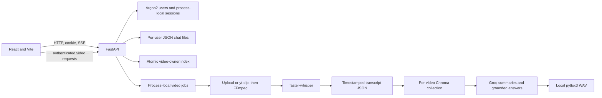

# VideoMind Project Recap

This document describes the implementation currently in the repository. The code and tests are authoritative if details change.

## System Overview

VideoMind is a local-first FastAPI and React/Vite application. A signed-in user uploads a media file or submits a YouTube URL, receives a timestamped transcript and structured summary, and asks grounded questions about that video. Conversations, account records, media artifacts, and derived artifacts are persisted as local files; there is no relational database.


```mermaid
flowchart LR
    Browser[React and Vite] -->|HTTP, cookie, SSE| API[FastAPI]
    API --> Auth[Argon2 users and process-local sessions]
    API --> Chat[Per-user JSON chat files]
    API --> Owners[Atomic video-owner index]
    API --> Jobs[Process-local video jobs]
    Jobs --> Media[Upload or yt-dlp, then FFmpeg]
    Media --> ASR[faster-whisper]
    ASR --> Transcript[Timestamped transcript JSON]
    Transcript --> RAG[Per-video Chroma collection]
    RAG --> LLM[Groq summaries and grounded answers]
    LLM --> TTS[Local pyttsx3 WAV]
    Browser -->|authenticated video requests| API
```

## Source Map

| Path | Responsibility |
|---|---|
| `backend/app/main.py` | Creates the FastAPI app and registers auth, chat, health, and video routers. |
| `backend/app/api/auth.py`, `dependencies.py` | Registration, login, `/auth/me`, logout, and current-session dependency. |
| `backend/app/api/chats.py` | Authenticated chat CRUD, Q&A, answer-audio generation/playback. |
| `backend/app/api/videos.py` | Authenticated upload, YouTube, status/SSE, media, transcript, summary, question, and audio routes. |
| `backend/app/services/auth.py`, `user_storage.py` | Argon2 password handling, in-memory sessions, atomic JSON user storage. |
| `backend/app/services/chat_storage.py` | Atomic per-user chat JSON persistence and canonical video-context hydration. |
| `backend/app/services/video_storage.py` | Atomic video-ID-to-owner index under `data/videos/.owners.json`. |
| `backend/app/services/video_processing.py`, `media.py`, `asr.py` | Process-local jobs, saved source media, temporary extraction, timestamped ASR. |
| `backend/app/services/rag.py` | Timestamp-preserving chunks, per-video Chroma collections, similarity filtering, transcript fallback selection. |
| `backend/app/services/llm.py`, `voice.py`, `tts.py` | Groq prompts, grounded Q&A and summaries, voice-question flow, WAV synthesis. |
| `frontend/src/App.tsx` | Theme persistence, login/register, session restoration, logout and expiry handling. |
| `frontend/src/VideoChatWorkspace.tsx` | Chat/video selection, ingestion, SSE/status refresh, chat questions and view state. |
| `frontend/src/WorkspaceComponents.tsx` | Sidebar, full chat history, composer, collapsed sources, audio controls, video/context panels. |
| `frontend/src/api.ts`, `styles.css` | Typed cookie-backed requests and shared responsive/theme styling. |
| `scripts/vanish.py` | Standalone deletion of the explicit runtime-data allowlist. |

## Authentication and Data Ownership

- Usernames are normalized and stored with Argon2 password hashes in `data/users/users.json`.
- Login sets an HTTP-only, SameSite=Lax cookie. Session IDs are random and held in memory for 12 hours; a backend restart invalidates them.
- `/auth/me` restores a session after refresh. The frontend does not store passwords or session identifiers in local storage. Only the selected theme is stored in `videomind.theme`.
- Each chat is stored at `data/chats/{username}/{chat_id}.json`. Reads, updates, deletes, message writes, and chat answer-audio access use the authenticated username; foreign chat IDs return `404`.
- Upload and YouTube routes assign the new video ID to the authenticated user in `data/videos/.owners.json` before processing. All video routes, including SSE, media playback, transcript, summary, voice audio, and Q&A, check this ownership. Creating or updating a chat also checks its video association.
- Old artifacts without an owner entry are not auto-claimed. Reprocess them under the intended account. Vanish deletes the owner index with the rest of `data/videos/`.
- The cookie is configured for local HTTP, and the service has no rate limiting, CSRF defense, durable sessions, or production multi-worker coordination. Do not expose this development deployment publicly.

## Video and Chat Workflows

1. `POST /videos/upload` or `POST /videos/youtube` returns `202` and a generated 32-character lowercase hexadecimal `video_id`; both require a signed-in account.
2. Uploads and YouTube downloads persist their source in `data/videos/`. FFmpeg's extracted audio is temporary. Background job state/events are process-local.
3. Processing writes timestamped segments to `data/transcripts/{video_id}.json`, indexes a Chroma collection named `video_{video_id}`, writes a structured summary to `data/summaries/{video_id}.json`, and generates summary audio under `data/audio/summaries/` when dependencies are available.
4. The frontend listens to owner-checked SSE events and refreshes status. When ingestion completes it creates and opens a chat associated with the video.
5. **New Chat** creates another JSON chat using the selected, already-processed `video_id`. It does not upload, download, or reprocess the source.
6. Reopening a chat restores the complete ordered message history. Transcript and summary are resolved from canonical video artifacts rather than copied into each chat unless supplied explicitly.
7. Chat Q&A saves the user message, sends only the latest three prior user/assistant messages as conversational context, retrieves evidence only from that video's collection, then saves the assistant answer, timestamped sources, and optional audio reference. Full persistent history is never sent wholesale to Groq.
8. Weak retrieval falls back to question-focused raw transcript excerpts capped at 12,000 characters. The RAG policy uses `top_k=5`, `MIN_SIMILARITY=0.70`, and `RELATIVE_MARGIN=0.10`. Sources are collapsed per answer and timestamps seek the video player.

Standalone video Q&A and voice-question routes share the same video-scoped RAG pipeline. Voice-question audio is temporary/query-only and is not added to the transcript index. Chat answer audio has owner-checked chat/message routes and stores only a reference in chat JSON, not WAV bytes.

## Frontend Behavior

The default theme is **Dark Modern**; **Solarized Light** is also available and persisted in browser local storage. The authenticated workspace has New Video, New Chat, Summary, Video, Transcript, existing chats, complete message history, and a bottom composer. On narrow screens the sidebar is a drawer. Sources are collapsed by default. Answer-audio controls are explicit-click and expose loading, playing, and retry states.

API calls include browser credentials. In-flight duplicate GETs are coalesced, and the request cache is invalidated at login/logout and protected-session expiry. Chat loads use a request sequence so late responses cannot replace a newer selection; switching chats clears the prior video context immediately.

## Runtime Data and Vanish

Runtime data is below `data/`: `videos/` (including `.owners.json`), `audio/`, `transcripts/`, `summaries/`, `chroma/`, `users/`, and `chats/`. `python scripts/vanish.py` removes contents only from these seven allowlisted directories and recreates/retains their directories. It preserves source code, configuration, dependencies, `.git`, project caches outside the allowlist, and any unlisted content directly under `data/`.

## Setup and Verification

From the repository root in PowerShell:

```powershell
py -3.13 -m venv .venv
.\.venv\Scripts\Activate.ps1
python -m pip install -r requirements.txt
Set-Location frontend
npm install
npm run build
Set-Location ..
python -m pytest
```

Set `GROQ_API_KEY` in the untracked local `.env`. FFmpeg is required for processing. ASR and embedding models may download on first use; local TTS requires a usable Windows SAPI voice. Tests mock external services and do not require a Groq credential.

Start the backend from the project root with `uvicorn backend.app.main:app --reload`. Start Vite from `frontend/` with `npm run dev`; the configured `/api` proxy targets `http://127.0.0.1:8000`.

## Known Limitations

- Sessions and processing jobs are in memory. Restarting the backend signs users out and loses job status; multiple workers do not share state.
- Runtime JSON, media, audio, and Chroma data are local to one machine. This is not a distributed or production storage design.
- There is no rate limiting, CSRF defense, durable queue, or HTTPS cookie configuration. Public deployment needs a deliberate security and operations review.
- Processing is resource-intensive and may require FFmpeg, model downloads, Groq access, disk space, and a Windows SAPI voice.
